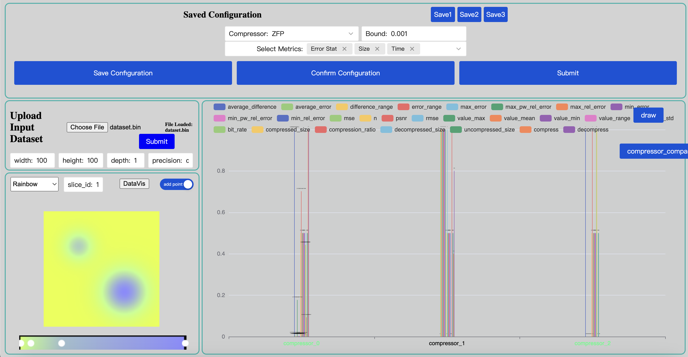
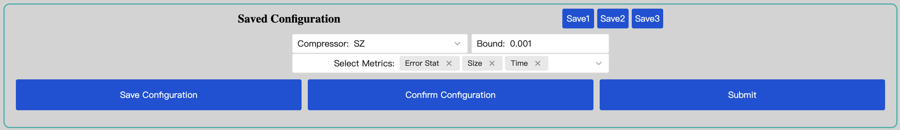
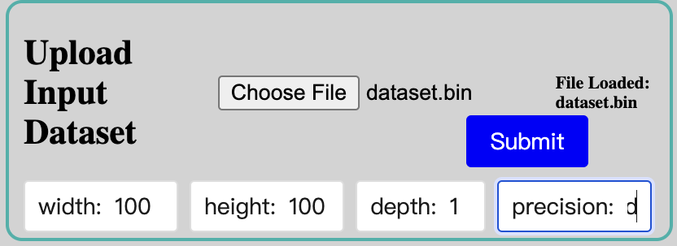
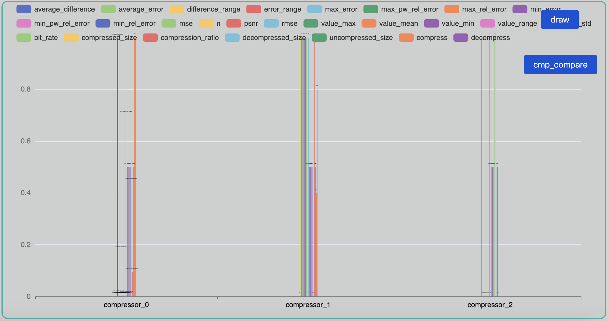
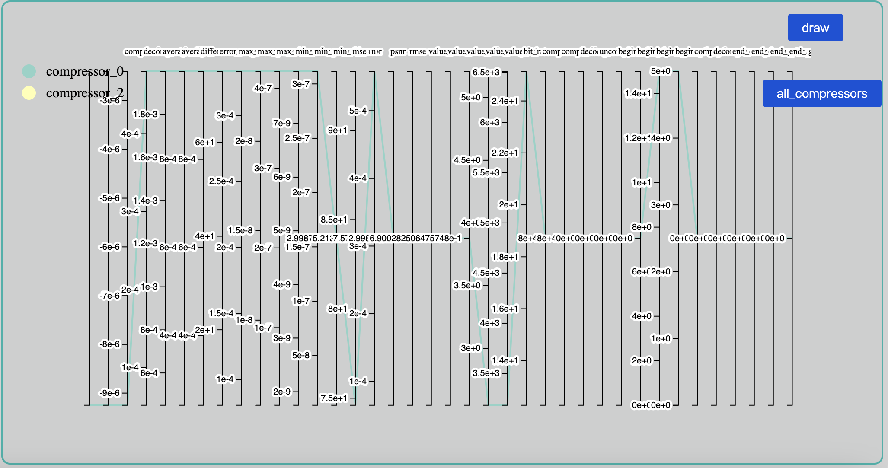
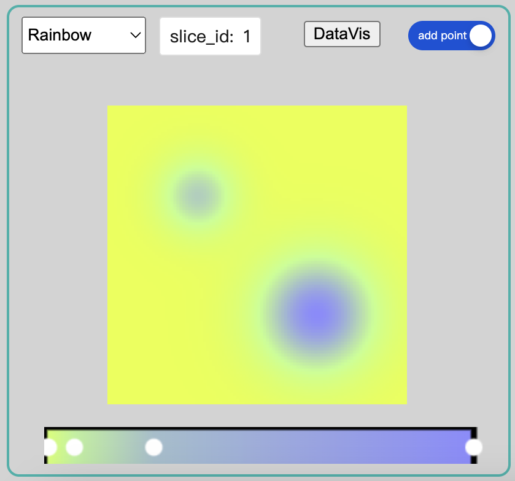

# FZ-VIS

FZ-VIS is a visualization tool designed for easy interaction with compressor configurations, dataset manipulation, and metrics comparison.  


# Installation

Clone the repository and follow [these instructions](./docs/install.md) to set up the project.

```sh
git clone https://github.com/YuxiaoLi1234/fzvis.git
cd fzvis
```

# Tutorial

## :computer: Dashboard Overview

The dashboard provides an intuitive interface for easy navigation and interaction with compressor configurations, dataset uploads, and metric visualizations.

The dashboard should look like the figure as shown below.


## :arrows_counterclockwise: Workflow

### Running a Compressor

- Compressor selection: choose a compressor from the dropdown list, e.g., SZ, ZFP.
- Error bound: enter the error bound value.
- Metric: select the categories of metrics you want to visualize.
- Configuration: confirm and save your configurations.



### Input Dataset
- Upload input dataset: select your dataset file to upload and fill in the dimensions along with the precision value (`d` for double precision, and `f` for single precision).
- Run the compressor: submit the configurations and execute the compression.



## :bar_chart: Visualization

The result in the visualization module should appear as the figure shown below.



### Interaction Usage

#### Compare metrics among compressors

1. After running all compressors, you need to click on the names of the compressors you want to compare.
   
2. Click on the `cmp_compare` button, the result should look like the figure shown below. Click on the `all_compressor` button to return to the bar plot visualization of all the compressors.
   
   
### Slice Visualization

After running the compressors, you can visualize a slice of the input data following these steps:
1. Enter the slice index in `slice_id`.
2. Click the `DataVis` button to view the data.
3. Use the color map selector at the bottom to customize the view.
4. Add control points (when `add point` mode is on) or drag existing control points (when `add point` mode is off).



